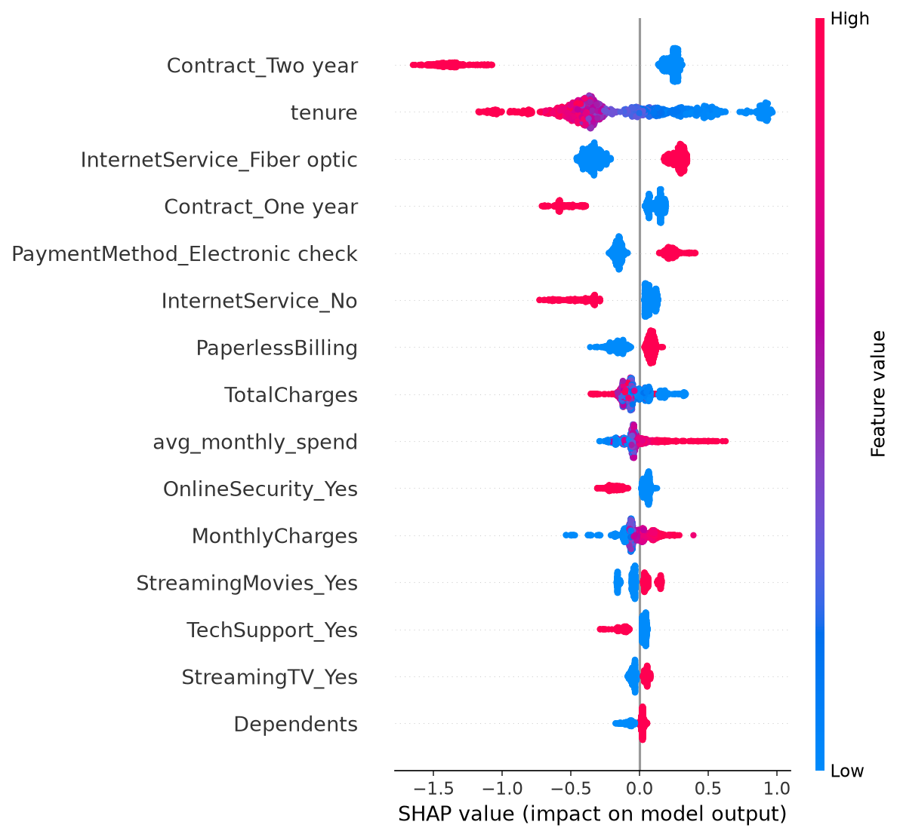
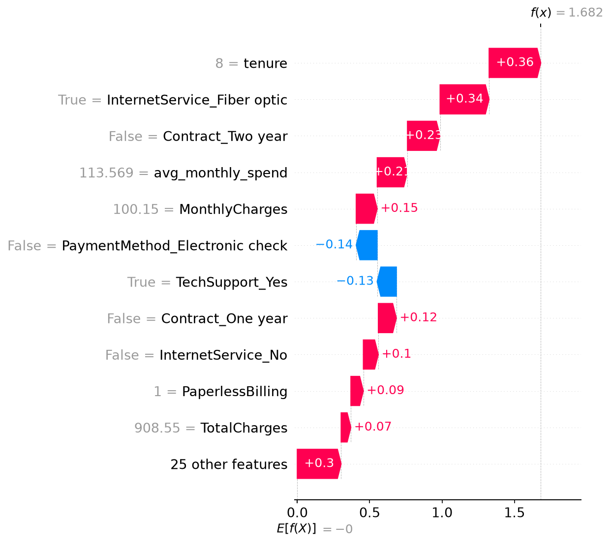

<div align="center">

# 📉 Customer Churn Prediction

**End-to-end ML system predicting telecom customer churn — XGBoost model, SHAP explainability, served via FastAPI, with a Streamlit dashboard frontend.**

[](https://python.org)
[](https://xgboost.readthedocs.io)
[](https://fastapi.tiangolo.com)
[](https://streamlit.io)
[](LICENSE)

[📂 Source Code](https://github.com/syedibrahimdev/customer-churn-prediction)

</div>

---

## 🧐 The Problem

Acquiring a new customer costs far more than retaining an existing one — yet most companies only realize a customer is unhappy after they've already cancelled. This project predicts which customers are at risk of churning before they leave, and explains exactly why, so retention teams can act with specific, targeted interventions instead of generic discounts blasted to everyone.

---

## 🏗️ Architecture

This project uses a two-service architecture, mirroring how ML systems are actually deployed in production — not a single script that does everything.

1. **FastAPI Backend** (`api/main.py`) — loads the trained model once at startup, accepts raw customer data, applies the exact same preprocessing used in training, and returns a churn probability + SHAP-based explanation
2. **Streamlit Dashboard** (`app.py`) — a separate frontend that sends HTTP requests to the API and renders the results — it never touches the model directly

**Data flow:** `Streamlit form` → `HTTP POST /predict` → `FastAPI (preprocessing → model.predict_proba → SHAP)` → `JSON response` → `Streamlit renders chart`

---

## 📊 Model Performance

| Model | ROC-AUC | F1 (Churn class) |
|-------|---------|-------------------|
| Logistic Regression | 0.842 | 0.608 |
| Random Forest | 0.823 | 0.588 |
| **XGBoost (tuned)** | **0.845** (test) | **0.625** |

Class imbalance (73.5% No Churn / 26.5% Churn) was handled via XGBoost's `scale_pos_weight` (2.769), not SMOTE — this avoids generating synthetic data and keeps the model's probability calibration closer to the real distribution.

XGBoost was selected as the final model despite a slightly lower ROC-AUC than Logistic Regression, because it scored highest on F1 for the churn class — the metric that matters most for catching customers who are actually about to leave (recall on the minority class).

Hyperparameter tuning via `RandomizedSearchCV` confirmed no overfitting: CV ROC-AUC (0.848) and test ROC-AUC (0.845) are nearly identical.

---

## 🔍 SHAP Explainability



Confirmed top churn drivers, verified against actual SHAP output:

- **Contract type** is the single strongest predictor — two-year contracts strongly reduce churn risk, month-to-month strongly increases it
- **Low tenure** is the second strongest signal — newer customers churn far more often
- **Fiber optic internet** correlates with higher churn risk than DSL or no internet
- **Electronic check payment** increases risk relative to automatic payment methods
- **Missing OnlineSecurity/TechSupport** add-ons correlates with higher churn — these services act as "stickiness" features

**Individual prediction example:**



This example shows a customer flagged at 84% churn risk (low tenure, fiber optic, no long-term contract) who ultimately did **not** churn — their TechSupport subscription and payment method partially offset the risk. This illustrates SHAP's real value: understanding *which factors are pulling in each direction*, not just a single probability score.

---

## 📁 Project Structure
customer-churn-prediction/
├── data/
│   ├── raw/                      # Original Telco Customer Churn dataset
│   └── processed/                # Train/test splits, fully encoded
├── notebooks/
│   ├── 01_EDA.ipynb              # Exploratory analysis, churn patterns
│   ├── 02_preprocessing.ipynb    # Feature engineering, encoding, split
│   ├── 03_modeling.ipynb         # Baselines, XGBoost, tuning, comparison
│   └── 04_shap_analysis.ipynb    # SHAP global + individual explanations
├── models/
│   ├── churn_model.pkl           # Final tuned XGBoost model
│   └── feature_columns.pkl       # Exact column order for inference
├── api/
│   └── main.py                   # FastAPI backend — /predict endpoint
├── reports/                      # Saved charts from notebooks
├── app.py                        # Streamlit dashboard (calls the API)
├── requirements.txt              # Streamlit + client dependencies
├── requirements-api.txt          # FastAPI service dependencies
└── README.md

---

## 🚀 Getting Started (Local)

```bash
git clone https://github.com/syedibrahimdev/customer-churn-prediction.git
cd customer-churn-prediction
pip install -r requirements.txt
pip install -r requirements-api.txt
```

**Terminal 1 — API:**
```bash
cd api
uvicorn main:app --reload --port 8000
```
Visit `http://localhost:8000/docs` to test it directly.

**Terminal 2 — Dashboard:**
```bash
streamlit run app.py
```
Visit `http://localhost:8501`.

---

## 📊 Dataset

- **Source:** [Telco Customer Churn (Kaggle)](https://www.kaggle.com/datasets/blastchar/telco-customer-churn)
- **Size:** 7,043 customers, 21 raw features (expanded to 36 after encoding)
- **Target:** `Churn` (Yes/No) — 26.5% positive class

---

## 🔧 Tech Stack

| Layer | Technology |
|-------|-----------|
| Language | Python 3.9+ |
| Modeling | XGBoost, Scikit-Learn |
| Explainability | SHAP |
| API | FastAPI, Pydantic, Uvicorn |
| Frontend | Streamlit |

---

## 🗺️ Roadmap

- [x] EDA and feature engineering
- [x] Baseline + XGBoost model comparison with imbalance handling
- [x] SHAP explainability (global + individual)
- [x] FastAPI backend with Pydantic validation
- [x] Streamlit dashboard calling the API
- [ ] Deploy API (Render) + Dashboard (Streamlit Cloud)
- [ ] Batch prediction endpoint (CSV upload)
- [ ] Model monitoring / drift detection over time

---

## 🤝 Contributing

Pull requests are welcome. For major changes, open an issue first to discuss what you'd like to change.

---

## 👨‍💻 Author

**Syed Ibrahim Ahmed**
[](https://github.com/syedibrahimdev)
[](linkedin.com/in/syed-ibrahim-ahmed-6aa304247/)

---

<div align="center">
  <sub>Built to show that knowing why a customer might leave matters as much as knowing if they will</sub>
</div>
